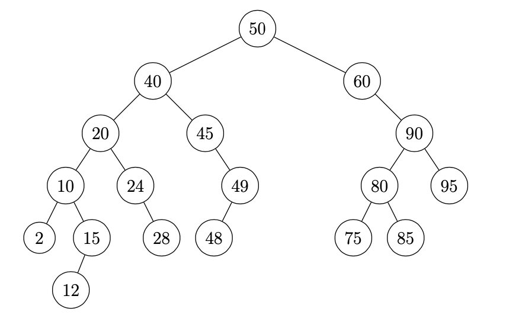

# Computer Science II
## Lab 15.0 - Binary Search Trees

An introduction Binary Search Tree data structures.

This is a lab used in Computer Science II (CSCE 156, CSCE 156H) in the 
[Department of Computer Science & Engineering](https://cse.unl.edu) at the 
[University of Nebraska-Lincoln](https://unl.edu).

## Overview

### Resources

Prior to lab you should read/review the following resources.

1.  Review this laboratory handout prior to lab.

2.  Review the course material on Binary Search Trees and
    Heaps

### Lab Objectives & Topics

Following the lab, you should:

-   Be familiar with Binary Search Trees and Heaps

-   Be able to implement and utilize tree traversal algorithms

-   Be able to utilize BSTs and Heaps in an application

### Peer Programming Pair-Up

To encourage collaboration and a team environment, labs will be
structured in a *pair programming* setup.  At the start of
each lab, you may be randomly paired up with another student by
a lab instructor.  One of you will be designated the *driver* 
and the other the *navigator*.  

The navigator will be responsible for reading the instructions 
and telling the driver what is to be done.  The driver will be 
in charge of the keyboard and workstation.  Both driver and 
navigator are responsible for suggesting fixes and solutions 
*together*.  Neither the navigator nor the driver is "in charge."  
Beyond your immediate pairing, you are encouraged to help and 
interact and with other pairs in the lab.

Each week you should try to alternate: if you were a driver 
last week, be a navigator next, etc.  Resolve any issues (you 
were both drivers last week) within your pair.  Ask the lab 
instructor to resolve issues only when you cannot come to a 
consensus.  

Because of the peer programming setup of labs, it is absolutely 
essential that you complete any pre-lab activities and familiarize
yourself with the handouts prior to coming to lab.  Failure to do
so will negatively impact your ability to collaborate and work with 
others which may mean that you will not be able to complete the
lab.  

## 1. Getting Started

Clone this project code for this lab from GitHub in Eclipse using the
URL: <https://github.com/cbourke/CSCE156-Lab15>. Refer to Lab 1.0 for
instructions on how to clone a project from GitHub.

## 2. Tree-Based Data Structures

### 2.1 Binary Search Trees

A *Binary Search Tree* (BST) is a data structure such that elements are
stored in tree nodes. Each tree node has a reference to its parent, left
child, and right child. Each node in a BST also has a key associated
with it. The Binary Search Tree Property is such that:

1.  All keys in a node's left-subtree are less than that node's key

2.  All keys in a node's right-subtree are greater than that node's key

An example:

The basic functionality such as adding elements, searching for elements,
and removing elements can be implemented with a complexity proportional to
the tree's depth. Searching, for example, starts at the root. If the
node corresponds to the element we are searching for we are done.
Otherwise, if the node has a key value less than the element we are
searching for we traverse to its right child. If the node has a key
value greater than the element we are searching for we traverse to its
left child and repeat until we have found the node or we reach the end
of a tree without finding our element.

An incomplete binary search tree Java implementation has been provided
for you. It has some basic functionality already. Your activities will
include adding additional methods to perform a search, and to traverse
the tree using several different traversal strategies and to count the
number of leaves in the tree.

A node in a binary tree is called a leaf if it has no children. Since
the structure of a binary search tree is determined by the order
elements are entered, there is no easily computable formula for the
number of leaves. Instead, a BST needs to be traversed and the leaves
counted up.

There are three traversal strategies that you will implement. The
implementation details are left up to you.  You may find that a recursive strategy is
the quickest to implement or you may find a stack data structure useful.
Each of these strategies begins at the root and visits a node and its
children in different orders.

-   Preorder Traversal: processes the node, then visits the nodes in the
    left-subtree then in the right-subtree

-   Inorder Traversal: visits the left-subtree first, then the node
    itself, then the right-subtree

-   Postorder Traversal: visits the left-subtree first, then the right-
    subtree, then the node itself

### 2.2 Heaps

A *heap* is a data structure similar to a binary search tree in that it
has a binary tree structure. The primary difference is that the key for
each node in the tree is larger than *both* of its children. There is no
restriction on the relation between the keys of child nodes. Another
condition of heaps is that they are full binary trees: each level of the
tree, with the possible exception of the final row has every node
present. This property ensures that operations such as add and remove
(from the top) can be performed with $O(\log(n))$ operations.

A heap can be implemented using a dynamic array.  The random access
ensures the optimal behavior of operations because the left and
right children (and parent) of each node has an easily computable
relationship using indices.  We won't be implementing a heap directly,
instead we'll use Java's `PriorityQueue` which is a basic (binary)
heap implementation.  We'll use this data structure to implement
a *heap sort* algorithm.

The basic idea is that elements are removed from a input list one-by-one and
are placed on a heap. Then, elements are successively removed from the
heap and placed back into the list. The heap property guarantees that
the maximal (or minimal) element is removed each time, imposing an
ordering.

## 3. Activities

### 3.1 Binary Search Tree Implementation

1.  Implement the search algorithm described above (the 
    `findElement()` method)

2.  Implement the three ordering methods as described above

3.  Implement the `getNumLeaves()` method

### 3.2 Heap Sort Implementation

1.  Refer to the `PriorityQueue` documentation, 
    <https://docs.oracle.com/en/java/javase/15/docs/api/java.base/java/util/PriorityQueue.html> 
    for how to use it.

2.  Use this implementation to implement the `heapSort()` method 
    in the `HeapSort` class. 
    
## 4. Testing, Submitting & Grading

* Test your programs using the provided JUnit test suite(s).  Fix any
errors and completely debug your programs.
* Submit the following files through webhandin:
  * `BinarySearchTree.java`
  * `HeapSort.java`
* Run the grader and verify the output to complete your lab.

## Advanced Activity (optional)

Another tree traversal strategy is a Breadth-First-Search (BFS)
traversal strategy. Starting at the root, nodes are visited
level-by-level in a left-to-right order. Design (or research) and
implement a BFS strategy on your binary search tree. Hint: look at the
non-recursive traversal strategies used in some of the methods provided
to you. Think of a similar strategy using a different data structure.

